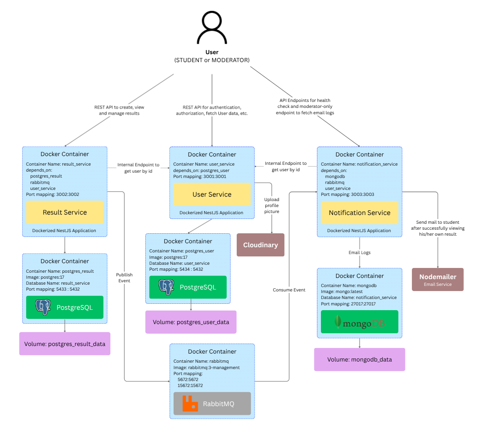
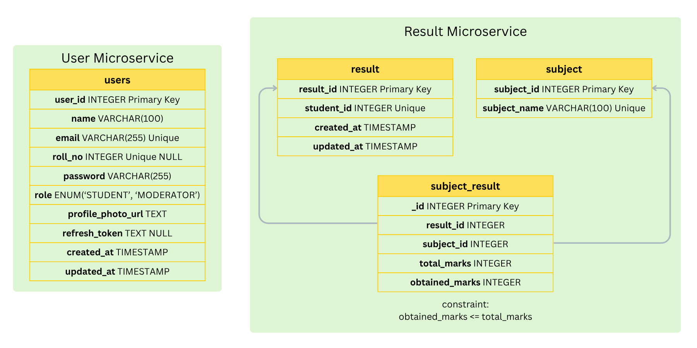
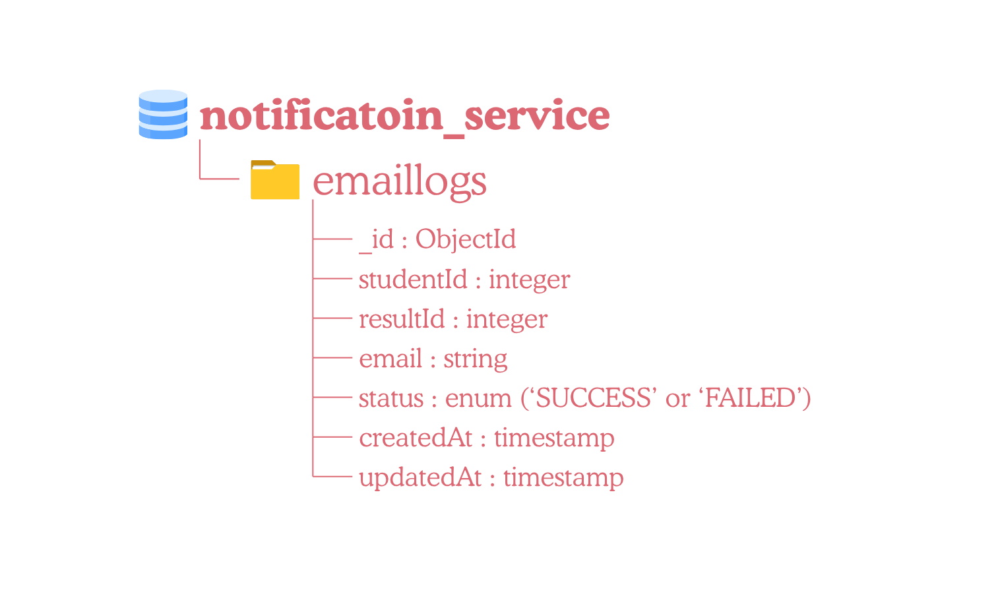

# Board Exam Result Platform

This is a backend for a Board Exam Result Platform developed as a set of independent microservices using NestJS.

## Technology Stack Used

- [**NestJS**](https://docs.nestjs.com/) - A [TypeScript](https://www.typescriptlang.org/) framework used for building [Node.js](https://nodejs.org/en) server side applications.
- [**Docker**](https://docs.docker.com/) - Containerization platform used to package and deploy all services.
- [**PostgreSQL**](https://www.postgresql.org/) - Relational database used by User Service and Result Service.
- [**MongoDB**](https://www.mongodb.com/docs/) - NoSQL database used by Notification Service for storing email delivery logs.
- [**RabbitMQ**](https://www.rabbitmq.com/docs) - Message broker used for asynchronous communication between Result service and Notification service.
- [**TypeORM**](https://docs.nestjs.com/recipes/sql-typeorm) - ORM used for PostgreSQL database interactions and migrations.
- [**Mongoose**](https://docs.nestjs.com/recipes/mongodb) - ODM used for MongoDB interactions.
- [**Swagger**](https://docs.nestjs.com/openapi/introduction) - API documentation tool.

## Microservices

There are three microservices for this platform.

### User Service (Port 3001)

Responsible for

- User registration
- User authentication
- JWT access token generation
- Refresh token rotation
- Role-based access control
- Internal API for inter-service communication

Database

- PostgreSQL - database name: user_service

### Result Service (Port 3002)

Responsible for:

- Creating examination results
- Viewing results
- Updating results
- Deleting results
- Publishing result-viewed events to RabbitMQ

Database:

- PostgreSQL (result_service)

### Notification Service (Port 3003)

Responsible for:

- Consuming RabbitMQ events
- Sending email notifications
- Logging email delivery attempts
- Exposing moderator-only email log API
- Health check endpoint

Database:

- MongoDB (notification_service)

## System Architecture



## Environment Variables

### User Service

```bash
JWT_SECRET="JWT_SECRET"
JWT_EXPIRY="15m" # access token expiry time
REFRESH_TOKEN_EXPIRY="7d" # refresh token expiry time
DB_HOST="postgres_user" # docker container name
DB_HOST_FOR_DATA_SOURCE=localhost # this is used by TypeORM CLI for migrations
DB_PORT=5432
DB_PORT_FOR_DATA_SOURCE=5434 # 5432 container port is mapped to 5434 host port
DB_USERNAME=postgres
DB_NAME="user_service"
DB_PASSWORD=postgres
INTERNAL_API_KEY="YOUR_API_KEY" # this can be a random text, this API key will be used by internal endpoint (internal/users/:id) to send user details to other services
CLOUD_NAME="CLOUDINARY_CLOUD_NAME"
CLOUDINARY_API_KEY="CLOUDINARY_API_KEY"
CLOUDINARY_API_SECRET="CLOUDINARY_API_SECRET"
PORT=3001 # user_service is running on port 3001
```

### Result Service

```bash
PORT=3002 # result_service is running on port 3002
JWT_SECRET="JWT_SECRET"
DB_HOST="postgres_result" # docker container name
DB_HOST_FOR_DATA_SOURCE=localhost # this is used by TypeORM CLI for migrations
DB_PORT=5432
DB_PORT_FOR_DATA_SOURCE=5433 # 5432 container port is mapped to 5433 host port
DB_USERNAME="postgres"
DB_NAME="result_service"
DB_PASSWORD="postgres"
INTERNAL_API_KEY="YOUR_API_KEY" # this should be same as INTERNAL_API_KEY in .env of user_service
USER_SERVICE_URL="http://user_service:3001"
RABBITMQ_URL="amqp://rabbitmq:5672"
RESULT_QUEUE="result_notifications" # name of the queue in RabbitMQ
```

### Notification Service

```bash
USER_SERVICE_URL="http://user_service:3001"
INTERNAL_API_KEY="YOUR_API_KEY" # this should be same as INTERNAL_API_KEY in .env of user_service
EMAIL_USER="your_email@example.com" # this is the email from which notifications will be sent
EMAIL_PASSWORD="APP_PASSWORD" # create app password for your email from Google Account > Security & sign-in
MONGODB_URL="mongodb://mongodb:27017/notification_service" # this can be connection string as well like this "mongodb+srv://<user>:<password>@cluster0.n4ms8yo.mongodb.net/notification_service?appName=Cluster0"
PORT=3003 # result_service is running on port 3003
JWT_SECRET="JWT_SECRET"
RABBITMQ_URL="amqp://rabbitmq:5672"
RESULT_QUEUE="result_notifications"
```

## Run the project

Create a new folder `board_exam`

```
board_exam
|-
```

```bash
cd board_exam
```

inside `board_exam/` directory, clone the following repositories

```bash
git clone https://github.com/swapnil-s-h/board_exam-user_service.git

git clone https://github.com/swapnil-s-h/board_exam-result_service.git

git clone https://github.com/swapnil-s-h/board_exam-notification_service.git
```

you'll now have folder structure like this:

```
board_exam
|- notification_service
|- result_service
|- user_service
```

Create one `.env` file each inside `notification_service/`, `user_service/` and `result_service/` directories with their respective content.

Move the file `docker-compose.yml` from `board_exam/user_service/` directory to `board_exam/` directory.

Folder strucure will now look like this

```
board_exam
|- notification_service
|   |- .env
|   |- other files
|- result_service
|   |- .env
|   |- other files
|- user_service
|   |- .env
|   |- other files
|- docker-compose.yml
```

There is a single `docker-compose.yml` file for the entire project. This file creates all images and runs containers.

Initially, our databases are empty, so we need to generate and run migrations that will create databases and tables. Scripts to generate and run migrations are already present in `package.json` of User Service as well as Result Service. So, just run the following commands inside respective services

```shell
cd user_service
npm run migration:generate -- src/migrations/initial-schema
npm run migration:run

cd result_service
npm run migration:generate -- src/migrations/initial-schema
npm run migration:run
```

Inside `board_exam/` directory, run

```shell
docker compose up --build
```

this will build images from `Dockerfile`s present inside `result_service/`, `user_service/` and `notification_service/` and start running the containers.

From next time onwards, generating and running migrations again is not necessary, just `docker compose up` to start the containers and `docker compose down` to remove the containers

## Database Schema

### PostgreSQL Database Schema



### MongoDB Database Schema



## Authentication and Authorization

The platform uses JWT-based authentication.

Roles:

- STUDENT
- MODERATOR

Access to protected resources is controlled using NestJS Guards and Role-Based Access Control (RBAC).
